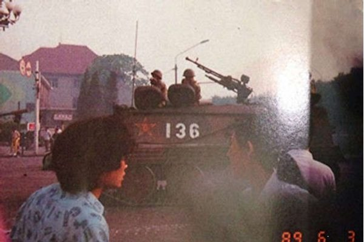

|<H1 style="text-align:center;">中共六四屠殺實錄（1）血幕拉開</H1>|
|:-|
| |

|中共高層緊急會議：定性「反革命暴亂」，做出清場決定|
| 1989年6月3日下午4:00在中南海勤政殿召集戒嚴緊急會議，參加的有楊尚昆、李鵬、喬石、姚依林、遲浩田、李錫銘、周依冰、羅干等人。會議接受了鄧小平、李鵬等人的定性，北京已發生「反革命暴亂」。據李鵬6月3日日記：「會議一致認為，當前形勢十分緊急，今天軍隊已和暴徒發生了正面衝突，不能再給他們以喘息的機會。今天如不及時採取行動，明天是星期日，將有更多的人進入天安門廣場，清場將更加困難。會議決定今晚從北京各方向集結待命的戒嚴部隊，星夜兼程向天安門進發，與已隱蔽在天安門四周的戒嚴部隊會合。在工人糾察隊的引導下，對天安門廣場實行清場。」|
|會議決定：3日晚9:00起，開始「平息首都發生的反革命暴亂」。戒嚴部隊於4日凌晨1:00抵達天安門廣場，6:00完成全部清場任務，決不能耽誤或拖延時間。部隊開進途中，任何人不得阻攔。如遇阻攔，戒嚴部隊可以採取一切手段予以排除。|

 <table border="1">

 <tr>
	<td></td>
	<td></td>
	<td></td>
 </tr>
 <tr>
	<td></td>
	<td></td>
	<td></td>
 </tr>
 </table>

